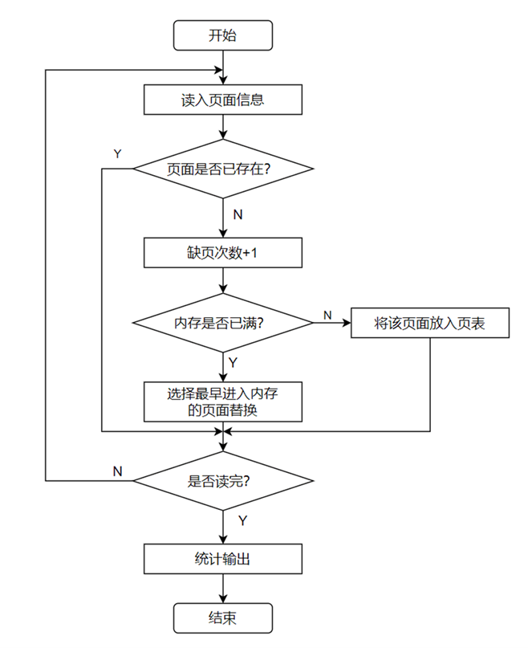
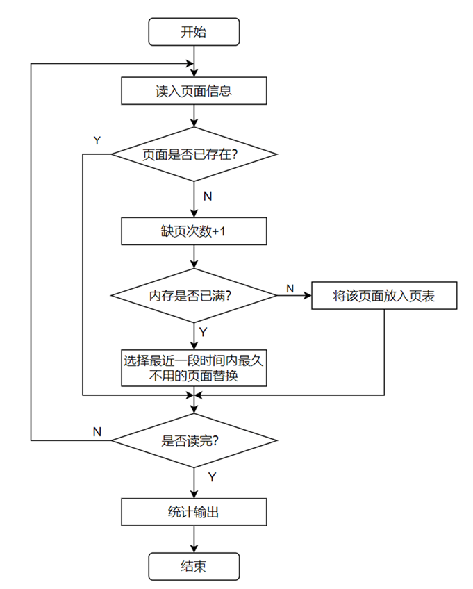
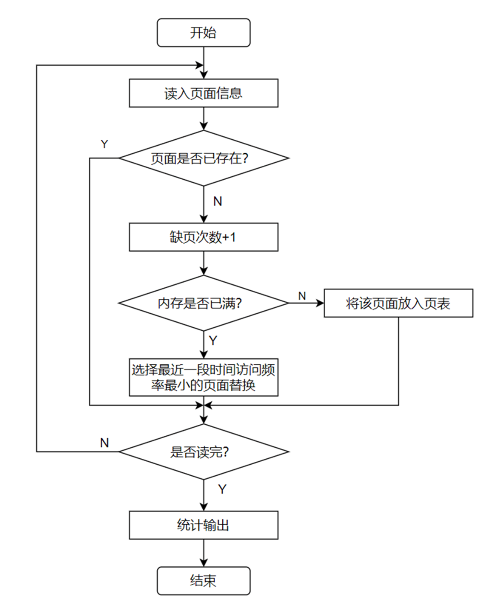
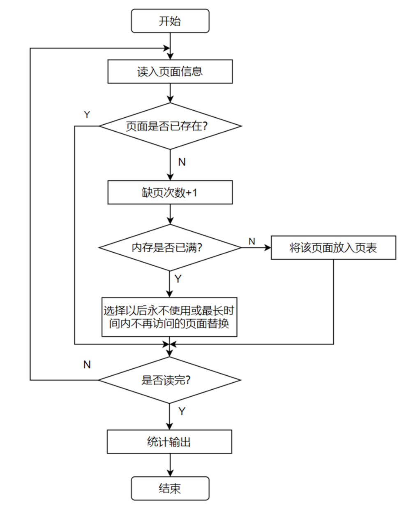
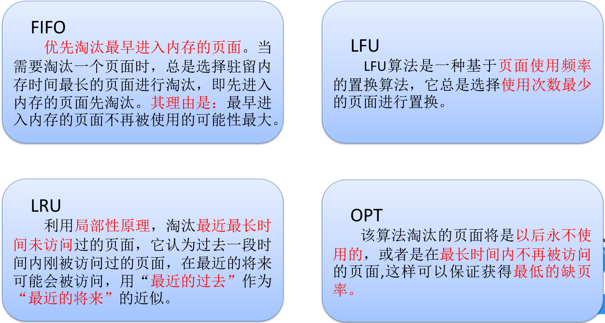

# 项目简介

​	使用QT和C++实现一个多线程页面置换算法运行过程的演示程序。 该项目采用多道程序思想，模拟页式存储管理中FIFO、LRU、LFU和OPT四种页面置换算法的运行过程。项目主要分为四个模块：参数设置、算法运行、结果分析和结果保存。使用QT的Designer框架设计了用户界面，并使用多线程管理页面置换算法的运行。

## 项目背景

​	页面置换算法是操作系统中用于管理虚拟内存的算法。在计算机中，物理内存是有限的，而进程需要使用的内存可能会超过物理内存的容量。为了解决这个问题，操作系统引入了虚拟内存的概念，即将进程所需的内存分成若干个页（或块），每个页的大小通常为2的幂次方，如4KB或8KB。

​	当进程需要访问某个页时，操作系统会根据需要将该页从磁盘读取到物理内存中进行访问。然而，当物理内存空间不足时，就需要进行页面置换，即将一些页从物理内存中移出，以便为即将访问的页腾出空间。页面置换算法的作用就是根据一定的策略决定哪些页应该被置换出去。

​	页面置换算法的出现是为了最大程度地提高内存利用率和系统性能。不同的页面置换算法采用不同的策略来选择置换的页，常见的算法包括FIFO（先进先出）、LRU（最近最少使用）、LFU（最不经常使用）和OPT（最佳置换）等。

​	FIFO算法简单地按照页进入物理内存的顺序进行置换，即最早进入的页被置换出去。LRU算法根据页的最近使用情况选择置换页，最久未使用的页会被置换。LFU算法则根据页的使用频率进行置换，使用频率最低的页会被置换。OPT算法是一种理论上最优的页面置换算法，它根据未来的访问情况进行预测，选择将最长时间内不会被访问到的页进行置换。

​	通过使用适当的页面置换算法，操作系统可以有效地管理虚拟内存，提高系统性能和内存利用率。选择合适的算法需要考虑诸多因素，如访问模式、工作负载、内存访问时间等。因此，页面置换算法的研究和优化对于操作系统的设计和性能优化至关重要。

## 目的&意义

​	页面置换算法在分页式存储管理中的作用是至关重要的。由于内存空间有限，无法一次性将进程的所有页面加载到内存中，因此当内存空间不足时，需要使用页面置换算法来选择哪些页面被淘汰，以便为新的页面腾出空间。页面置换算法的选择规则决定了淘汰哪些页面，从而影响系统的性能。

​	衡量页面置换算法性能的一个重要指标是缺页次数。较少的缺页次数意味着算法的性能较好，因为较少的缺页次数表示内存中的页面被频繁地使用，无需频繁地从磁盘中调入和调出页面，从而减少开销和提高系统效率。

​	通过模拟页面置换算法，我们可以在特定的工作负载下评估不同算法的性能表现。通过模拟，我们可以比较不同算法的命中率（hit rate）、缺页率（page fault rate）以及其他性能指标，从而找到最优的算法。这样可以帮助我们选择最适合特定情况的页面置换算法，以提高系统的性能和资源利用率。

​	在实际的操作系统中，不同的应用程序和工作负载会导致不同的访问模式和内存访问需求。因此，选择最适合的页面置换算法是至关重要的。通过模拟，我们可以快速、低成本地比较不同算法的性能，以便在实际应用中选择最优算法。

​	此外，模拟页面置换算法还具有教学和研究的意义。页面置换算法可以帮助学生和研究人员深入了解算法的工作原理、优缺点以及如何根据特定问题选择最适合的算法。通过模拟，可以观察和分析不同算法在不同情况下的表现，从而增加对页面置换算法的理解和洞察力。

## 项目功能

1. 输入一个逻辑页面访问序列和随机产生逻辑页面访问序列，由四个线程同时完成每个算法；
2. 能够设定驻留内存页面的个数、内存的存取时间、缺页中断的时间、快表的时间，并提供合理省缺值，可以暂停和继续系统的执行；
3. 能够随机输入存取的逻辑页面的页号序列；
4. 能够随机产生存取的逻辑页面的页号序列；
5. 能够设定页号序列中逻辑页面个数和范围；
6. 能够设定有快表和没有快表的运行模式；
7. 提供良好图形界面，同时能够展示四个算法运行的结果；
8. 给出每种页面置换算法每个页面的存取时间；
9. 能够将每次的实验输入和实验结果存储起来，下次运行时或以后可查询；

## 算法原理

### FIFO：先进先出页面置换算法

​	算法思想：优先淘汰最早进入内存的页面。当需要淘汰一个页面时，总是选择驻留内存时间最长的页面进行淘汰，即先进入内存的页面先淘汰。其理由是：最早进入内存的页面不再被使用的可能性最大，算法流程图如图。

### LRU：最近最久未使用页面置换算法

​	算法思想：利用局部性原理，淘汰最近最长时间未访问过的页面，它认为过去一段时间内刚被访问过的页面，在最近的将来可能会被访问，用“最近的过去”作为“最近的将来”的近似。算法流程图如图。

### LFU:最少使用页面置换算法

​	算法思想：LFU算法是一种基于页面使用频率的置换算法，它总是选择使用次数最少的页面进行置换。具体运行过程如下：

- 当需要调入一个新页面时，遍历内存中所有页面，选择使用次数最少的页面进行替换。
- 将新页面加载到内存中。
- 更新页面使用记录，将新页面的使用次数记录下来。

算法流程图如图。

### OPT:最佳页面置换算法

​	算法思想：该算法淘汰的页面将是以后永不使用的，或者是在最长时间内不再被访问的页面,这样可以保证获得最低的缺页率。因为无法预知一个进程在内存的若干个页面，哪个在未来最长时间内不再被访问，所以该算法在实际中无法实现。但是可以作为评价其他页面置换算法的对比样本。

## 四种算法优缺点

